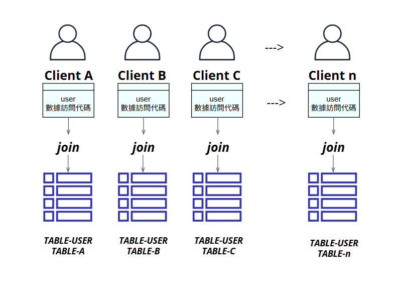
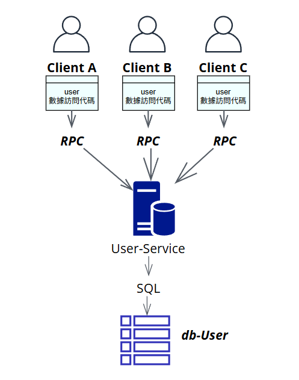

# Day1_案例分析_系統解耦與資料庫瓶頸
多業務DB瓶頸，服務器無法擴容

這個 Git 儲存庫旨在解決一個由於早期系統設計決策導致的資料庫瓶頸和擴容困境。

專案背景：

在系統發展初期，為了節省資源，我們將用戶的通用數據和各業務的個性化數據都存放在同一個資料庫實例中。業務在查詢數據時，習慣性地使用 SELECT JOIN 操作來同時獲取通用用戶數據和業務個性化數據。

面臨的問題：

緊密耦合的數據模型： 由於各業務都通過 JOIN 操作依賴於通用用戶數據庫，導致通用用戶數據庫與所有業務的個性化數據庫之間形成了高度的耦合。
單一資料庫實例的瓶頸： 隨著數據量的快速增長和併發量的提高，單一資料庫實例無法再承受所有業務的查詢壓力，成為系統的性能瓶頸。
難以水平擴容： 由於數據之間的 JOIN 依賴，簡單地將數據庫實例進行分庫分表變得極其困難，設備本身也無法再進行垂直擴容。
本專案目標：

本專案旨在通過引入新的架構和技術，解耦通用用戶數據和各業務個性化數據，消除對單一資料庫實例的強依賴，從而實現：

提升系統吞吐量和響應速度。
實現數據庫的水平擴展能力。
提高各業務模組的獨立性和可維護性。
預期方案（可能包含）：

數據拆分 (Data Sharding)： 將通用用戶數據與業務個性化數據分離。
引入數據服務層 (Data Service Layer)： 抽象數據訪問，將 JOIN 邏輯從業務代碼中剝離，或考慮使用聚合服務來組合來自不同數據源的數據。
考慮使用 MQ (Message Queue) 或其他異步機制： 優化數據同步或後台操作，進一步解耦業務邏輯。
這個專案將是我們系統架構演進中的關鍵一步，旨在構建一個更具彈性和可擴展性的數據基礎設施。

# 方案1.介紹：引入 User-Service 服務層
你提供的架構圖展示了一個針對現有資料庫瓶頸和耦合問題的解決方案，核心思想是引入一個User-Service (用戶服務) 層。

現有問題回顧 (透過圖示隱含)：

在舊的架構中，很可能各個 Client A、Client B、Client C（代表不同的業務單元或應用程式）都直接透過自己的「用戶數據訪問代碼」來查詢和操作 db-User 資料庫。正如之前討論的，這種直接訪問和 JOIN 操作導致了資料庫的緊密耦合和性能瓶頸。

新架構方案說明：

你的圖示清楚地展示了透過引入 User-Service 來解決這些問題：

用戶服務 (User-Service)：

這是一個獨立的、專門負責處理所有與「用戶數據」相關業務邏輯和資料庫操作的服務。
它負責將 db-User 的複雜性（例如 SELECT JOIN 等）封裝在內部。
User-Service 是唯一直接與 db-User 資料庫交互的元件，透過 SQL 語句進行數據查詢和更新。
客戶端 (Client A, Client B, Client C)：

這些客戶端（代表不同的業務系統或應用程式，如訂單系統、個人資料系統等）不再直接訪問 db-User。
它們轉而透過 RPC (Remote Procedure Call) 的方式，遠程調用 User-Service 提供的介面（API）來獲取或修改用戶數據。
每個客戶端內部仍然保有「用戶數據訪問代碼」，但這些代碼現在是用來呼叫 User-Service 的 RPC 介面，而不是直接操作資料庫。
方案帶來的優勢：

資料庫解耦 (Database Decoupling)：

db-User 不再直接暴露給所有的客戶端，而是被 User-Service 隔離。
客戶端現在只依賴於 User-Service 的介面，而不再關心數據在 db-User 中如何存儲、如何 JOIN，極大地降低了耦合度。
單一職責與集中管理 (Single Responsibility & Centralized Management)：

所有關於用戶數據的邏輯都集中在 User-Service 中，便於統一管理、維護和迭代。
例如，如果用戶數據的數據模型發生變化，只需要修改 User-Service 內部邏輯，而無需修改所有客戶端。
提高性能與可擴展性 (Improved Performance & Scalability)：

User-Service 可以根據需要獨立進行擴展（例如，增加 User-Service 的實例數量）。
User-Service 內部可以針對用戶數據的訪問進行性能優化，例如引入緩存、讀寫分離等，這些優化對客戶端是透明的。
由於減少了客戶端直接對資料庫的 JOIN 操作，降低了資料庫的直接壓力。
促進微服務架構 (Facilitating Microservices Architecture)：

這個 User-Service 實際上就是一個典型的微服務。它為後續將整個單體應用拆分成更多獨立服務奠定了基礎。

# 方案2.介紹：每個業務走User-API取資料(一勞永逸)

| 階段       | 重點            | 技術                | 成效                          |
| :--------- | :-------------- | :------------------ | :---------------------------- |
| **第一步** | 禁止新業務寫 JOIN | Code Review / Linter | 避免雪上加霜，阻止問題惡化    |
| **第二步** | 拆分通用 user 資料庫 | Sharding            | 輕裝化現有資料庫負載，為解耦鋪路 |
| **第三步** | 建立 Data Service 層 | REST / GraphQL 聚合  | 解耦 JOIN、統一數據入口，提高可維護性 |
| **第四步** | 引入快取 / 同步機制 | Redis + MQ          | 提升效能、減少跨 DB 查詢，提高系統響應速度 |
| **最終階段** | 完整轉為多模組微服務 + 聚合層架構 | Kubernetes + API Gateway | 可水平擴展、模組清晰獨立，實現高彈性系統 |

數據拆分（Sharding / 拆庫）

1.拆出一份獨立的「User 通用資料庫」，只存通用 user 資料。

各業務資料庫分別管理其個性化資料，不再與通用庫 JOIN。

使用 user_id 為主鍵做軟性關聯，由業務層控制。

2.資料聚合層（Data Service Layer / 聚合 API）

提供一層聚合服務（如：user-profile-service），接受查詢請求，內部各自拉取通用與個性化資料，組合後回應前端。

對應技術選項：

使用 BFF（Backend For Frontend）

GraphQL（可動態聚合跨資料源字段）

REST + 聚合服務（最簡做法）

3.引入快取與查詢優化

Redis / Memcached 快取通用 user 資料與組合後的查詢結果（讀多寫少時效果好）

使用 CQRS 模式（Command Query Responsibility Segregation）分離查詢與寫入邏輯

4.異步同步與事件總線（MQ）

當 user 通用資料更新時，透過 Kafka / RabbitMQ 發事件，各業務資料庫同步更新一份冗餘的通用資料（即反正規化）

可進一步支援資料局部查詢，不需要實時 JOIN

5.過渡期解法（分階段解耦）

引入「虛擬 JOIN」：業務邏輯不做 DB JOIN，而在應用層做兩段查詢（先查通用 user，再查個性化）

開始收斂各業務查詢方式，統一改走 Data Service

